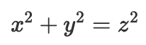
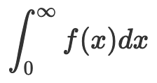

# dokuwiki-plugin-katex

A dead simple KaTeX math plugin for [Dokuwiki](https://www.dokuwiki.org/).

## Usage

After installing this by importing the [ZIP file][rel-zip], the syntax is
accessible from basically anywhere as far as I can tell.

[rel-zip]: https://github.com/paulsnar/dokuwiki-plugin-katex/releases/latest/download/dokuwiki-plugin-katex.zip

For inline math:

    $$ x^2 + y^2 = z^2 $$

    <math> \int _0 ^{\infty} f(x) dx </math>

# License

[BSD 0-clause](./LICENSE.txt)
